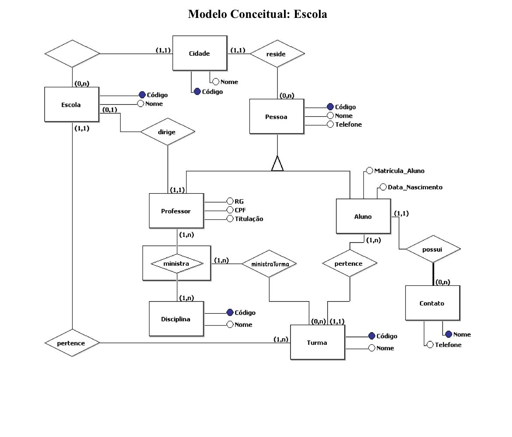

# SCHOOL MODEL

My first time using sql to crate schemas and manage data of a conceptual model of a school. This is a project for one of my university subjects in wich we are learning about database. The photo below represents the conpectual model that we were suposed to transform into schemas and then create it using MySQL.

